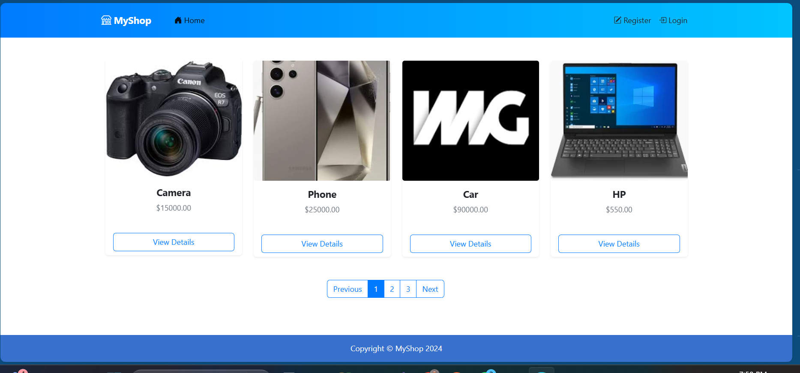
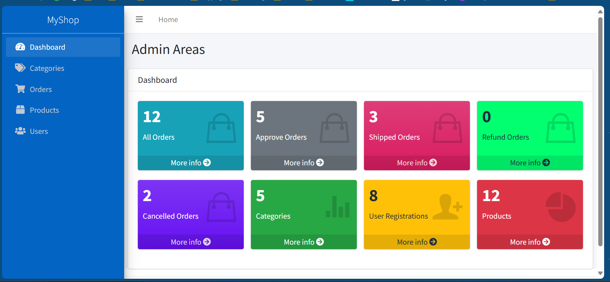
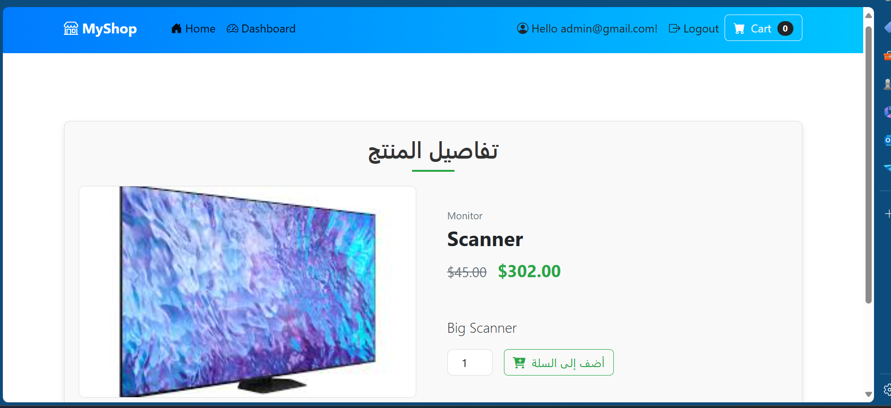
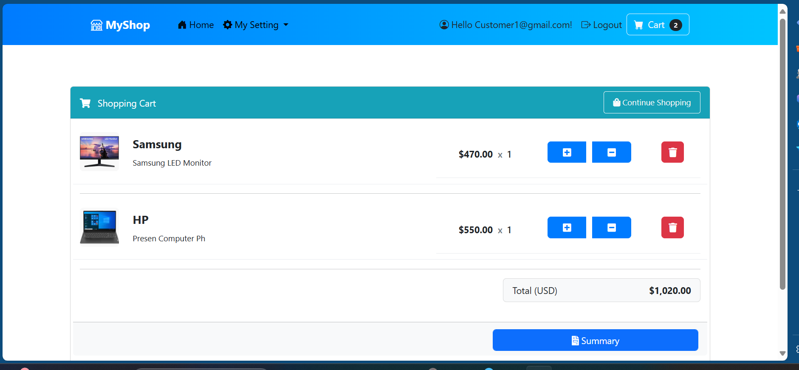

# Build a Shopping Cart Using .NET Core from Scratch
## Overview
**ShoppingCart** This project demonstrates how to develop a full-featured shopping cart using .NET Core, following modern development practices and a multi-layered architecture (NTier). It's a hands-on application inspired by the course **"Build a Shopping Cart Using .NET Core from Scratch."** The goal is to provide developers with a step-by-step guide to creating scalable and maintainable applications.

## Features

- **Multi-Layered Architecture (NTier):** A structured approach to building applications, ensuring scalability and maintainability.
- **Repository Pattern & Unit of Work:** Enhances code organization and promotes better testability through the application of these design patterns.
- **Entity Framework Core:** Handles database operations efficiently, with support for migrations and optimized queries.
- **Theme Customization:** Learn how to integrate and personalize a pre-built theme for the application interface.
- **User Management & Role-Based Access Control:** Secure your application by managing users, roles, and permissions using ASP.NET Identity.
- **Interactive JavaScript Libraries:** Integrate powerful libraries like jQuery Datatables for dynamic tables and Toaster JS for user-friendly notifications.
- **Admin Dashboard:** Manage products, orders, and users with an intuitive admin panel.
- **Pagination Support:** Efficiently display large datasets, such as product listings, using server-side pagination.
- **Session Management:** Store user-specific data during browsing sessions, providing a smooth user experience.
- **Stripe Payment Integration:** Seamlessly handle online payments with the Stripe payment gateway.

## Technologies Used

- **ASP.NET Core MVC** 
- **Entity Framework Core** 
- **ASP.NET Identity** 
- **Stripe Payment API**
- **JQuery, Datatables, Toaster JS**

  
## Images

**ShoppingCart_Home**

**ShoppingCart_Dashboorad**

**ShoppingCart_DetailsPorduct**

**ShoppingCart_Cart**

